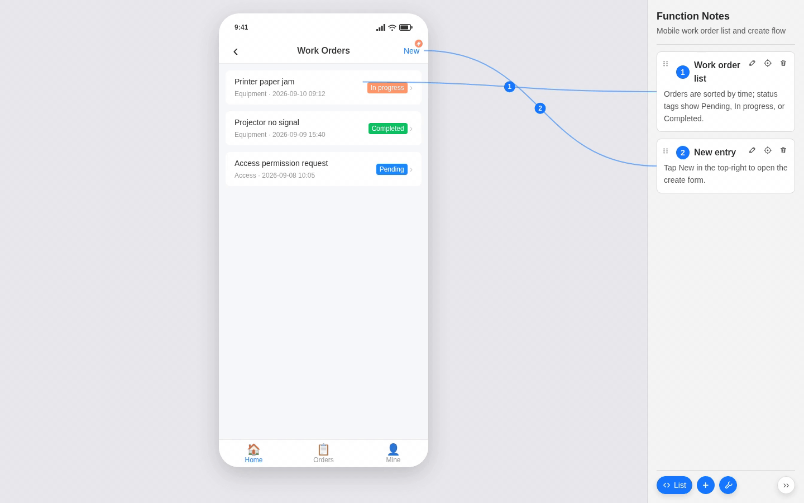
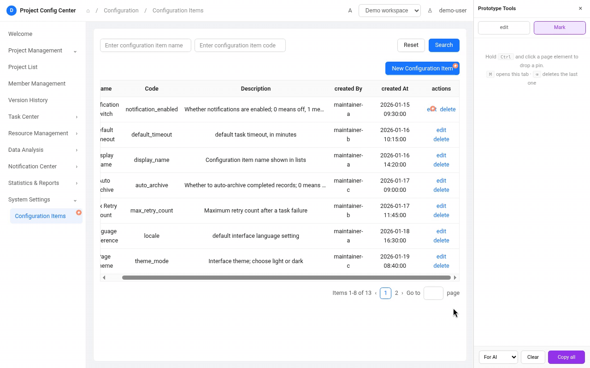
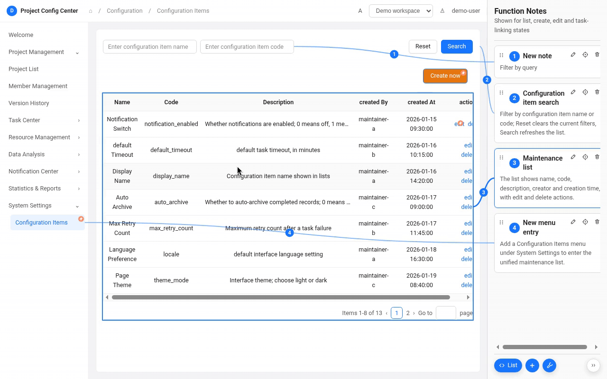

# HTML Prototype

[中文](README.zh-CN.md)

> AI-assisted HTML UI prototyping toolkit and Agent Skill for Claude Code, Codex, Cursor, and other coding agents.

Build, annotate, review, screenshot, and iterate native HTML prototypes on the real DOM. HTML Prototype combines reusable UI packs, DOM-bound annotations, AI-ready review context, element-to-source inspection, and reproducible multi-state screenshots in a zero-dependency workflow.

## Install the Agent Skill

```bash
npx skills add https://github.com/Lisuiwen/html-prototype --skill html-prototype-build
```

The skills CLI records anonymous aggregate installs for its leaderboard, so real installs also help the project become discoverable in the Agent Skills ecosystem.

Most prototype workflows fail after the mock looks “good enough”:

- Screenshots have no DOM, so an AI has to guess structure and drifts on every change.
- Review comments live in docs or chat—“move this left”—and never map cleanly to an element.
- Specs, review notes, and source stay disconnected, so verifying a fix is slow.

HTML Prototype reconnects that loop with native HTML: build pages from a UI pack, annotate and review on the real DOM, copy instructions to an AI, and jump from a locked element back to source. **The page is the deliverable, not just a picture of one.**

Experimental 0.x · zero npm dependencies · MIT · [Changelog](CHANGELOG.md)

## See it first

### 1. Sidebar: create, edit, delete, and group annotations

Viewer keeps formal notes in a right-hand panel. You can add, edit, delete, and browse annotations, group them by page state, and follow SVG connectors to the matching modules—all on the same page. Annotations are isolated per page state and grouped across multi-state flows.



### 2. Page review: pin feedback and copy it for AI

Drop removable review pins on real HTML elements. Collect notes, then use `Copy all → For AI` to export selectors plus element HTML snapshots as editable context for an agent.



### 3. Inspector: lock an element and open its source

Hold `Alt + Shift` and hover a page element to see its selector; click to open that location in your local IDE—less searching and guessing in the file tree.



## Why it matters

### Annotations bound to real elements

Formal notes are not sticky labels on a screenshot. They are structured data in `notes.snapshot.js`. Viewer renders copy, anchors, SVG connectors, and interaction state onto the live page so every note maps back to a concrete DOM target.

### Stable pages from a reusable UI pack

Compose pages from a local UI pack with shared tokens, components, and patterns. That reduces invent-from-scratch drift when an agent builds admin-style screens, and keeps later prototypes visually consistent.

### Executable review context

Review pins can be injected, copied in bulk, and removed without polluting the formal page. Exports carry stable selectors, element HTML snapshots, and reviewer notes—context an agent can act on.

### Jump from the page to source

A localhost authoring server on `127.0.0.1` edits notes, rebinds anchors, and opens source. Authoring chrome stays separate from the formal deliverable, so prototypes stay light and portable.

### One state model, many outputs

`PrototypeViewers` owns product state. The same prototype supports in-page review and scenario screenshots (`scenarios`) that emit clean PNGs without annotation chrome. Create, edit, empty, linked, and other states stay explicit, reproducible, and batchable.

### Clean deliverables

Formal prototypes keep semantic DOM, stable anchors, and render logic only. Viewer notes, Mark pins, and Inspector tooling are an authoring layer you can load or strip—they do not belong in the final HTML handoff.

## What you get

A typical prototype task yields three coordinated outputs:

- **Runnable prototype files** — native HTML you can open locally or via the authoring server
- **Reusable state definitions** — snapshot notes and `scenarios` as a stable baseline for later edits
- **Multi-state screenshots** — batch PNGs for create / edit / empty / linked views without the notes rail, connectors, or author tools

Review pins stay in the authoring layer. Screenshots and formal files stay clean. When you need another pass, reload the mark layer or paste For-AI context into an agent.

## How it fits together

```text
Native HTML
   │
   ├── Viewer: formal notes, groups, SVG connectors
   ├── Mark: page review, selectors, element snapshots, Copy for AI
   ├── Inspector: lock elements, show selectors, open source
   └── Screenshot: scenario-based clean page captures
```

This fits admin consoles, config pages, and interaction prototypes that change often: product marks issues on the page, AI gets precise context, and authors can return to source quickly to verify.

## Getting started

Requirements: Node.js 18+. Scenario screenshots also need a local Microsoft Edge or Google Chrome install.

```powershell
# Open the sample with formal notes (use the printed 127.0.0.1 URL)
node skills/html-prototype-build/runtime/serve.mjs examples/minimal-notes/prototype.html --snapshot=examples/minimal-notes/prototype/notes.snapshot.js
```

```powershell
# Batch clean screenshots from snapshot scenarios
node skills/html-prototype-build/runtime/shoot.mjs examples/minimal-notes/prototype.html
```

Install `skills/html-prototype-build/` into your agent skill path (keep the folder name `html-prototype-build`), then ask the agent to build or revise a prototype from your materials.

The walkthrough sample is [`examples/minimal-notes`](examples/minimal-notes) (demo UI copy is Chinese). Human operator steps live in the [Skill handbook](skills/html-prototype-build/README.md); agent routing and hard constraints live in [`SKILL.md`](skills/html-prototype-build/SKILL.md). Those Skill docs are currently Chinese—use the commands above or ask an agent that can read them.

## Layout

```text
skills/html-prototype-build/   Self-contained Skill (copy this folder)
examples/                      Runnable minimal prototype
media/                         README demo assets
scripts/                       Validation entry
tests/                         Runtime contract tests
```

## Scope

This is an AI-assisted HTML prototyping toolkit—not a production component library, not a Figma replacement, and not a third-party design-system implementation. It fits best when you need to:

- turn UI materials into openable HTML quickly;
- review on the real page and hand precise feedback to an AI;
- iterate structure, copy, and state while keeping reproducible screenshots.

## Security boundaries

- `serve.mjs` binds to `127.0.0.1` only. Do not run authoring or screenshots against untrusted HTML or snapshot files.
- Note writes are limited to snapshot files under the prototype directory. Keep `.env` local for IDE selection; never commit it.
- html-mark is a temporary review layer. It may store page fragments in `localStorage` or copy them to the clipboard. It is not part of the formal deliverable.
- Do not put real credentials, production data, personal information, or unauthorized brand assets in prototypes.

## Contributing

This project is experimental 0.x; APIs and layout may change. See [`CONTRIBUTING.md`](CONTRIBUTING.md) and [`CODE_OF_CONDUCT.md`](CODE_OF_CONDUCT.md). Report vulnerabilities privately per [`SECURITY.md`](SECURITY.md).

The UI pack is an original native-HTML visual simulation. It does not bundle third-party design-system code or official assets.

## License

[MIT](LICENSE). Third-party attribution is in [NOTICE](NOTICE) (html-mark credit and Apache ECharts).
