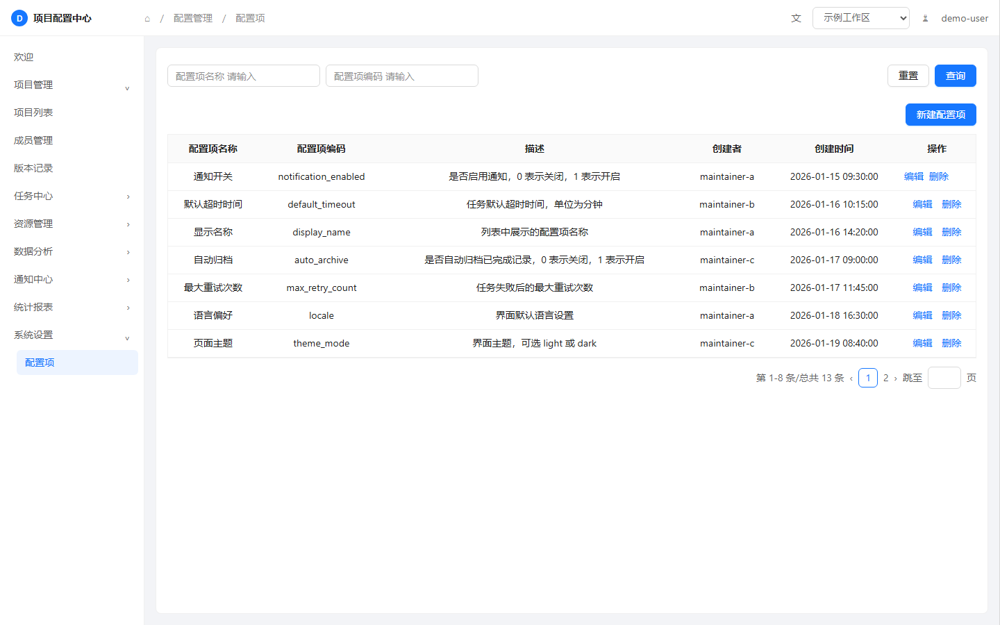

# HTML Prototype Build

> 实验性项目（0.x）：面向中文 AI 协作工作流的零依赖原生 HTML 原型 Skill。

## English summary

HTML Prototype Build is an experimental, zero-runtime-dependency toolkit for creating,
reviewing, documenting, and screenshotting native HTML product prototypes in
AI-assisted workflows. It provides composable local UI packs, formal product
annotations, temporary review pins, a localhost authoring service, and
scenario-based screenshots driven by a shared JavaScript state coordinator.

It is not a production UI component library, a complete accessibility
implementation, or an official Ant Design project. APIs and directory layouts
may change before the first stable release.

### English quick start

Requirements: Node.js 18 or later. State screenshots additionally require a
local Microsoft Edge or Google Chrome installation.

```powershell
# Start the local authoring service for the included example.
node skills/html-prototype-build/runtime/serve.mjs examples/minimal-notes/prototype.html --snapshot=examples/minimal-notes/prototype/notes.snapshot.js

# Generate state screenshots for the included example.
node skills/html-prototype-build/runtime/shoot.mjs examples/minimal-notes/prototype.html
```

Open the printed `http://127.0.0.1:<port>/...` address in a browser. The
authoring service is for trusted local files only; do not run it against
untrusted HTML or snapshot files.

用于生成、评审和交付原生 HTML 产品原型的 Agent Skill。它将可组合 UI 包、正式功能说明、临时评审打点、本地作者工具和按状态截图组合为一个可渐进读取的工作流。

## 当前状态

本仓库当前为实验性 0.x 阶段，接口和目录仍可能变化。运行时只依赖 Node.js 内建模块；截图功能还需要本机 Edge 或 Chrome。

## 能力

- 按 UI Token 重建单文件 HTML 原型。
- 通过 `snapshot.js + viewer.js` 生成正式右侧说明与 SVG 连线。
- 向现有 HTML 注入可移除的 html-mark 评审层。
- 在 `127.0.0.1` 本地作者服务中编辑说明并使用 Inspector 定位源码。
- 由 `PrototypeViewers` 在 JavaScript 中统一管理组合业务状态，DOM 仅保留语义、稳定锚点和渲染输出。
- 根据 snapshot 的显式 `scenarios` 与 `?scene=<id>&collapsed=1` 按场景批量截图。

## 快速开始

将 `skills/html-prototype-build/` 目录安装到你的 Agent Skill 路径（安装为 `<skills-root>/html-prototype-build/`），或在 Agent 会话中读取 `skills/html-prototype-build/SKILL.md`。脚本均可从任意位置调用：

```powershell
# 为 HTML 注入可双击打开的评审层。
node <skill-root>/runtime/prepare-mark.mjs <prototype.html> --inline

# 启动本地作者服务。
node <skill-root>/runtime/serve.mjs <prototype.html> --snapshot=prototype/notes.snapshot.js

# 按 snapshot 显式场景生成纯页面截图。
node <skill-root>/runtime/shoot.mjs <prototype.html>
```

完整约束与按任务分流见 [skills/html-prototype-build/SKILL.md](skills/html-prototype-build/SKILL.md)。可运行的正式标注样例位于 [examples/minimal-notes](examples/minimal-notes)。

## 案例截图

最小案例使用 `skills/html-prototype-build/runtime/shoot.mjs` 从 `notes.snapshot.js` 的 `scenarios` 枚举场景并生成纯页面截图，截图不包含右侧说明、SVG 连线或作者工具：



| 状态 | 截图 |
|---|---|
| 基础列表 | [base.png](examples/minimal-notes/screenshots/base.png) |
| 新建配置项 | [create.png](examples/minimal-notes/screenshots/create.png) |
| 编辑配置项 | [edit.png](examples/minimal-notes/screenshots/edit.png) |
| 任务关联配置项 | [strategy.png](examples/minimal-notes/screenshots/strategy.png) |

重新生成案例截图：

```powershell
node skills/html-prototype-build/runtime/shoot.mjs examples/minimal-notes/prototype.html
```

## 目录

```text
skills/
└─ html-prototype-build/   可独立复制的完整 Skill（含 SKILL.md 与全部依赖资源）
examples/                  可直接打开的最小原型
```

## 安全边界

- `serve.mjs` 仅监听 `127.0.0.1`，不会暴露到局域网。
- 说明写回仅允许目标 HTML 所在目录内的 snapshot 文件。
- `.env` 仅供本机 Inspector 指定 IDE 使用，不应提交。
- 原型中不应包含真实凭据、生产数据、个人信息或未授权品牌资源。
- `shoot.mjs` 只应对自己信任的 HTML 和 snapshot 运行。
- 本地作者服务会按 `CODE_EDITOR` 配置启动 IDE；不要使用来源不明的 `.env`。
- `html-mark` 是临时评审层，不属于正式交付物；它可能把页面片段保存到浏览器本地存储或复制到剪贴板。

## 开源协作

- 贡献规范见 [CONTRIBUTING.md](CONTRIBUTING.md)。
- 安全漏洞请按 [SECURITY.md](SECURITY.md) 私下报告，不要在公开 Issue 中提交可利用细节。
- 行为规范见 [CODE_OF_CONDUCT.md](CODE_OF_CONDUCT.md)。
- 当前项目为实验性 0.x 版本，尚未承诺稳定 API；问题反馈和功能建议请使用仓库的 Issue 或 Discussion。

## 第三方名称与归属

`Ant Design` 是其权利人的商标。本项目中的 `antd-admin` 仅表示对已确认
Ant Design 风格特征的原生 HTML 视觉模拟；本项目未获 Ant Design 官方背书，
不代表官方实现，不捆绑 Ant Design 代码或设计资源，也不承诺与任何特定
Ant Design 版本兼容。详见 [THIRD-PARTY-NOTICES.md](THIRD-PARTY-NOTICES.md)。

## 许可证

[MIT](LICENSE)
