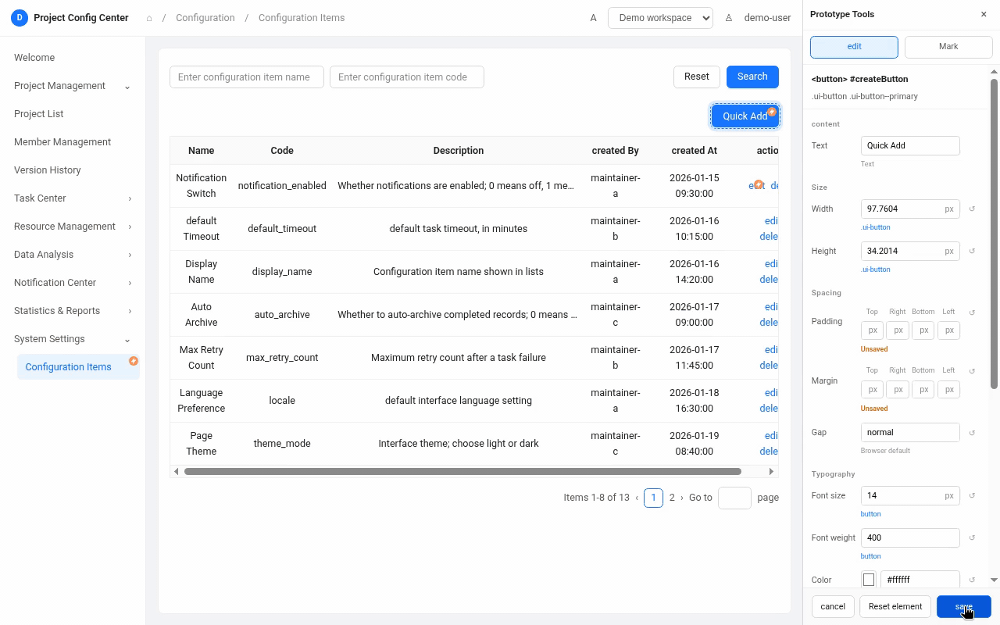
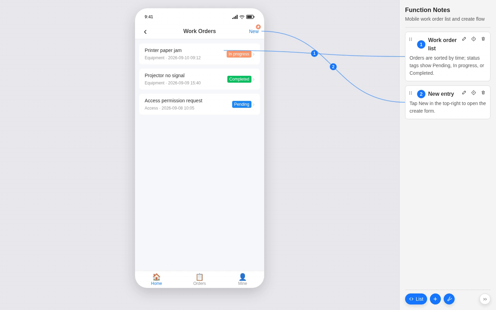
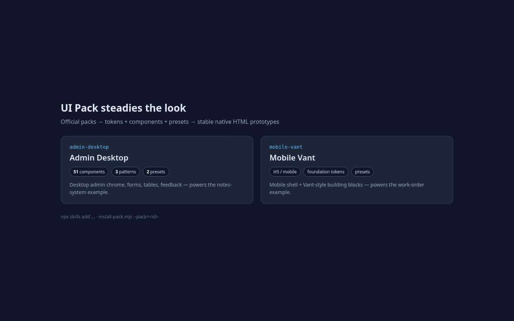

# AI HTML Annotation

[English](README.md)


> 面向 Claude Code、Codex、Cursor 等编程 Agent 的 Skill：原生 HTML 原型 + 真实 DOM 标注。

**页面本身就是交付物，不只是一张效果图。** 用 UI 包搭页，在真实 DOM 上标注，把意见复制给 AI，并输出不含作者工具的多状态截图。

实验性 0.x · 零 npm 依赖 · MIT · [更新日志](CHANGELOG.md)

## 为什么需要它

聊天意见对不上元素，对着截图写的 HTML 会漂，说明 / 聊天 / 源码各说各的。[产品指南](docs/guide.zh-CN.md) 写清为何失败、环上的四个岗位，以及编号步骤。

```text
用 UI pack 生成 HTML
        │
        ▼
     Viewer
        │
        ├── Mark → Copy for AI   (optional)
        ├── Direct Edit          (optional)
        └── Inspector            (optional)
        │
        ▼
   scenarios
```

Mark、Direct Edit、Inspector 是 Viewer 之后的并行可选项，不是一条必走的线性链。

## 你可以先看演示

走读视频：[media/hero-main.mp4](media/hero-main.mp4)（GitHub 不一定会自动播放 — 打开文件即可）。

### 像产品一样直接在页面上读标注

正式标注绑在真实 DOM 上。增删改查标注、切换页面状态、沿 SVG 连线定位模块 — 都在同一页，不用另开一份说明文档。


### 把问题钉在元素上，复制给 AI

按住 `Ctrl`（macOS：`⌘`）点击元素，打上可移除的评审 pin。然后用 `Copy all → For AI` 导出 selector 和元素 HTML。


### 在真实页面上改样式或文案

作者工具 → **edit**。按住 `Ctrl`（macOS：`⌘`），改文案或样式（例如背景色），保存。编辑器界面只存在于作者会话，不会注入交付物。



### 锁定看起来不对的地方，跳回源码

按住 `Alt + Shift` 悬停查看选择器，单击即可在本机 IDE 打开对应位置。


### 交付不含作者工具的多状态截图

多状态截图会藏掉标注栏、连线和作者工具。正式 HTML 仍可以带 Viewer；PNG 是纯页面。



### 用 UI 包生成，让页面视觉保持稳定

可安装的视觉系统 — Token、组件、Pattern — 不打进 Skill。官方 UI 包：`admin-desktop`（桌面后台）与 `mobile-vant`（手机宽度 H5）。



## 适合 / 不适合

**适合**：

- 尽快把 UI 材料落成可打开的 HTML；
- 在真实页面上评审，并把意见准确复制给 AI；
- 改结构、文案和状态，同时保留可复现截图；
- 后台、配置页、交互原型需要跨任务保持视觉稳定。

**不适合**当作生产组件库、Figma 替代品、第三方设计系统实现，或通用前端脚手架 / 生产代码生成器。

## 安装

默认用 skills.sh。然后安装 UI 包（桌面用 `admin-desktop`，手机用 `mobile-vant`），再打开作者工具 — 步骤见[5 分钟 quickstart](docs/quickstart.zh-CN.md)。

```bash
npx skills add https://github.com/Lisuiwen/ai-html-annotation --skill html-prototype-build
```

打开本仓库 [`examples/minimal-notes-system/prototype.html`](examples/minimal-notes-system)（桌面样例）。

Claude Code Marketplace 为备选：`/plugin marketplace add Lisuiwen/ai-html-annotation`，再 `/plugin install ai-html-annotation@lisuiwen-agent-skills`。Pack 作者再安装 `ui-pack-maintain`。

## 样例

- 默认走读：[`examples/minimal-notes-system`](examples/minimal-notes-system)（桌面后台）。
- 备选：[`examples/mobile-work-order`](examples/mobile-work-order)（移动 H5，`mobile-vant`）。

## 接下来看哪里

- [产品指南](docs/guide.zh-CN.md) — 为何失败、四个场景、能力、编号步骤
- [Quickstart](docs/quickstart.zh-CN.md) · [UI 包](docs/ui-packs.zh-CN.md) · [对比](docs/comparison.zh-CN.md) · [FAQ](docs/faq.zh-CN.md)
- [文档索引](docs/README.zh-CN.md)
- Skill 怎么用 → [html-prototype-build README](skills/html-prototype-build/README.zh-CN.md)（[English](skills/html-prototype-build/README.md)）

Skill 参考、UI 包契约和 addon 文档为英文。

## 进阶

作者工具、安装 UI 包、截图命令：[本地作者服务](skills/html-prototype-build/references/local-authoring.md)、[Pack install](skills/html-prototype-build/references/pack-install.md)、[截图](skills/html-prototype-build/references/screenshots.md)。Agent 分流：[SKILL.md](skills/html-prototype-build/SKILL.md)。

## 分发结构

```text
.claude-plugin/marketplace.json  Claude Code Marketplace 清单
.html-prototype/packs/           官方 UI 包
skills/html-prototype-build/     原型构建 Agent Skill
skills/ui-pack-maintain/         UI 包维护 Agent Skill
examples/                        可运行样例
media/                           README 演示素材
docs/                            产品文档
```

## 安全

- 作者工具只绑定 `127.0.0.1`。不要对不可信 HTML 跑作者工具和截图。
- 作者写接口要求 localhost 同源 JSON。Skill 根目录的 `.env` 只用于本机 IDE 选择，不要提交。
- Direct Edit 与 Mark 只在作者会话中加载。Direct Edit 经 localhost 写回样式 / 文案；Mark 把 pin 存在页面作用域的 `localStorage`，也可能复制到剪贴板。它们都不会注入源 HTML。
- 原型中不要放真实凭据、生产数据、个人信息或未授权品牌。

## 开源协作

实验性 0.x，接口和目录仍可能变化。贡献见 [`.github/CONTRIBUTING.md`](.github/CONTRIBUTING.md)，行为规范见 [`.github/CODE_OF_CONDUCT.md`](.github/CODE_OF_CONDUCT.md)，漏洞请按 [`.github/SECURITY.md`](.github/SECURITY.md) 私下报告。

本项目 UI 包为自研原生 HTML 视觉模拟，不捆绑第三方设计系统代码；包内引用的库（例如 `admin-desktop` 中的 Apache ECharts）随包分发，见 [NOTICE](NOTICE)。

## 许可证

[MIT](LICENSE)。第三方溯源见 [NOTICE](NOTICE)（含 html-mark 致谢与 Apache ECharts）。
